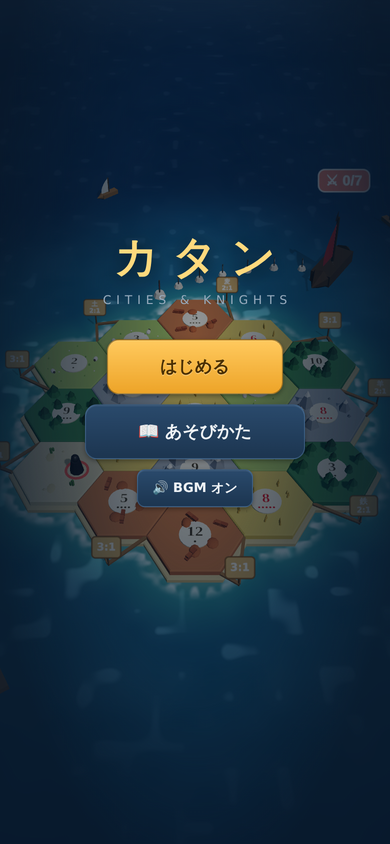
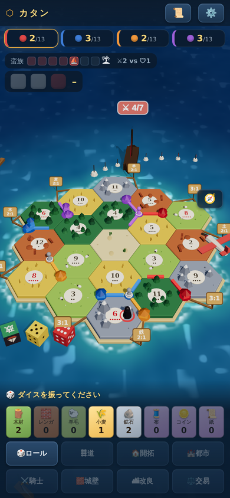
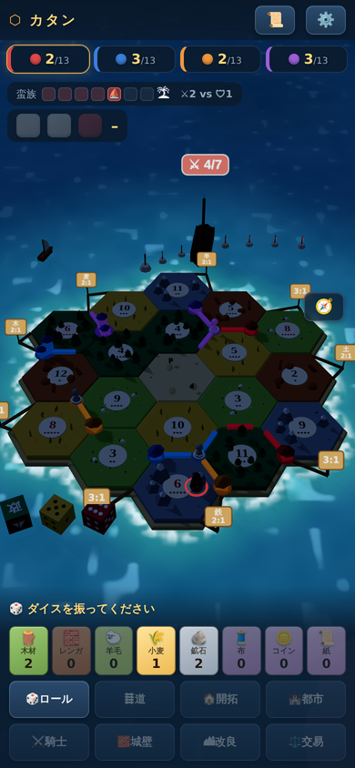
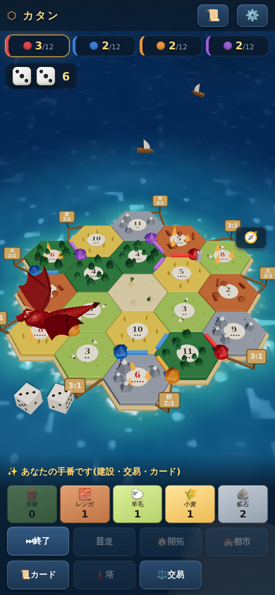

# catan-web — 3Dで遊ぶカタン(都市と騎士 + オリジナル拡張)

Vanilla JavaScript + Three.js で 1 から作った、ブラウザで動くカタン。
プレイヤー 1 人 vs CPU 2〜3 体で、基本カタンから拡張「都市と騎士」、
さらにオリジナルルール「ドラゴンの島」まで遊べる。
ビルド工程なし・外部サービスなし・依存はベンダリング済みの Three.js のみ。

**▶ 今すぐ遊ぶ:** https://junia2009.github.io/catan_city_knight/
(スマホ推奨。PWA なのでホーム画面に追加すればアプリのように起動できる)

| タイトル | 都市と騎士(昼) | 夜 | 🐉 ドラゴンの島 |
|---|---|---|---|
|  |  |  |  |

## 遊べるルール(3種類)

### 基本カタン(10点先取)

いわゆる標準カタン。開拓地と都市を建て、道を伸ばし、サイコロの出目で資源を集めて
銀行交易・港交易・プレイヤー間交易で回す。発展カード(騎士・街道建設・収穫・独占・勝利点)、
最長交易路、最大騎士力もすべて実装。まずはここから。

### 都市と騎士(13点先取)

公式拡張「Cities & Knights」の主要システムを一通り実装した本命モード。

- 都市が**商品**(布・コイン・紙)を産出し、商品で**都市改良**(交易・政治・科学の3系統)を進める
- 改良 Lv3 で公式どおりの特典 — 交易=**商館**(商品2:1)、政治=**要塞**(騎士Lv3)、
  科学=**水道橋**(産出ゼロのロールで好きな資源1枚)
- 系統最速で Lv4 に到達すると**メトロポリス**(+2点)
- イベントダイスで**蛮族**が迫り、**騎士**を雇い・活性化して島を守る。
  防衛に成功すれば「カタンの守護者」、失敗すれば都市が焼かれる
- **進歩カード全54枚**(公式構成: 交易・政治・科学 × 各18枚)。錬金術師で出目を操作したり、
  破壊工作員で相手の手札を捨てさせたり、スパイでカードを盗んだり
- 城壁(手札上限+2)、商人、初期配置は開拓地+都市、といった細かいルールも公式準拠

### 🐉 ドラゴンの島(12点先取・本作オリジナル)

盗賊の代わりに**ドラゴン**が島に棲むオリジナルルール。

- ドラゴンは最も出目の良い山に**巣**を作り、そのヘックスの産出を封鎖する
- **ゾロ目**が出るとドラゴンが暴走! 最も稼いでいるヘックスへ飛んでいき、
  **8手番のあいだ炎上**させ、隣接プレイヤーの資源を焼く
- 対抗手段は**見張り塔**(木+レンガ+鉱石、1人2基まで)。塔が守るヘックスが
  襲われると撃退に成功し、**財宝**(+1点と資源1枚)を獲得
- 「良い土地ほど狙われる」ため、強い土地に居座る定石にリスクが生まれ、
  塔のタイミングと立地の読み合いが加わる

ルールの正確な仕様と公式から簡略化した点は [docs/RULES.md](docs/RULES.md) に明記。
アプリ内でも「📖 あそびかた」からいつでも読める。

## 特徴

### 3D の盤面と演出(Three.js)

- **海**: シェーダー製。島に近いほど浅く明るいエメラルド、沖は深い藍。
  波のうねり・岸辺の泡・雲の影が流れる
- **空**: スカイドームに太陽と星空。**5分で昼→夕→夜→朝が一周**し、
  照明・影の濃さ・フォグ・海の色まで連動する(夜は月明かりの青に)
- **地形**: ヘックスごとに起伏があり、山・森・畑がそれぞれの植生で飾られる。
  ヨットや飛行機が島の周りを行き交う
- **コマと演出**: 羽ばたくドラゴンと火炎ブレス、蛮族船が航路ブイに沿って迫る様子、
  転がる 3D ダイス、交易成立のバナーなど、状態の変化は必ず目に見える形で起きる
- 3D が動かない環境向けに **2D Canvas 表示**へワンタップ切替(こちらもダイス演出付き)

### スマホファーストの UI

- 縦持ち全画面・ボトムシート・セーフエリア対応。頂点や辺の選択は
  「候補をタップ → 確定」の2段階タップで誤操作を防ぐ
- PWA 対応(Service Worker はネットワーク優先なので常に最新版で起動する)

### 対戦相手として成立する CPU

- 貪欲法 + 盤面評価で、建設・騎士運用・都市改良・進歩カード54枚の使いどころまで判断する
- **難易度3段階**(弱い・普通・強い)。評価関数に決定的ノイズを加える方式なので、
  難易度を変えてもゲームの乱数列は変わらない
- **プレイヤー間交易**: こちらから提案できるだけでなく、CPU からも提案が届く。
  CPU は損得を計算して応じ、断られた CPU はしばらく再提案してこない

### その他

- **中世風 BGM**: 音源ファイルを一切使わず、Web Audio でコード進行・パッド・撥弦・笛を
  リアルタイム合成するジェネレーティブ音楽
- **決定性**: すべての乱数はシード制御(URL に `?seed=123`)。同じシードは同じゲームになり、
  バグ報告・テスト・リプレイに使える。ダイスの公正性は χ² 検定で統計監査済み

## ローカルで動かす

ES Modules を使っているため、ローカルサーバー経由で開く:

```sh
npm run serve   # または python3 -m http.server 8000
# → http://localhost:8000/ を開く
```

インストールもビルドも不要(`npm install` すら要らない)。

## 開発

```sh
npm test                     # 単体テスト + セルフプレイ検証(Node のみ、ブラウザ不要)
npm run selfplay             # CPU 4体の自動対戦ゲート(node scripts/selfplay.js 1000 等)
node scripts/dice-audit.mjs  # ダイス乱数の統計監査(χ²検定バッテリー)
```

ルールエンジンは DOM に依存しない純粋関数の集まりなので、Node だけで全ルールが検証できる。
最重要の不変条件は**保存則**(銀行+全手札 = 資源19×5・商品12×3)と、
セルフプレイ数百ゲームの完走。

- 設計の全体像・状態機械・AI・レンダラー構成は [docs/ARCHITECTURE.md](docs/ARCHITECTURE.md)
- 実装ルールの正確な仕様は [docs/RULES.md](docs/RULES.md)
- 作業手順・E2E レシピ・デバッグフックは [CLAUDE.md](CLAUDE.md)
- `main` に push すると GitHub Actions がテストを通してから GitHub Pages にデプロイする
  (`.github/workflows/pages.yml`)

## プロジェクト構成

```
index.html              # 単一ページ(CSS込み)。importmap で three をベンダー読込
sw.js                   # Service Worker(ネットワーク優先)
src/
├── main.js             # 起動・画面フロー・入力モード・CPU駆動・演出
├── state.js            # GameState 定義(JSON化可能な単一オブジェクト)
├── actions.js          # 全アクションの validate / apply(dispatch の一本道)
├── rng.js              # シード制御の疑似乱数(mulberry32系)
├── rules/              # ルールエンジン(純粋関数、canvas 非依存)
│   ├── board.js  build.js  dice.js  robber.js  trade.js  victory.js
│   ├── cak/            # 都市と騎士(騎士・蛮族・都市改良・進歩カード54枚)
│   └── dragon.js       # ドラゴンの島(暴走・炎上・見張り塔・財宝)
├── ai/                 # CPU(合法手列挙・評価関数・思考・カード別プラグイン)
├── render/             # 2D Canvas 描画 + DOM HUD + あそびかた
├── render3d/board3d.js # Three.js レンダラー(海・空・地形・コマ・演出)
└── audio/bgm.js        # ジェネレーティブBGM(Web Audio)
test/                   # node --test(85テスト: ルール・統計・セルフプレイ)
scripts/                # セルフプレイゲート・乱数監査
vendor/                 # Three.js(MIT)
```

## 開発の歩み

| フェーズ | 内容 | 検証 |
|---|---|---|
| Phase 1 | 基本カタン + 貪欲法CPU | セルフプレイ1000ゲーム |
| Phase 2 | 都市と騎士の盤面要素(商品・騎士・蛮族・都市改良) | セルフプレイ300ゲーム |
| Phase 3 | 進歩カード全54枚 + カード別CPU判断 + 難易度 | セルフプレイ300ゲーム |
| 独自拡張 | 🐉 ドラゴンの島 / プレイヤー間交易 / BGM / 海・空・島の描画強化 | 各機能ごとにE2E+セルフプレイ |

## スコープ外

オンライン対戦 / 「航海者」等の他公式拡張 / クラウド同期
